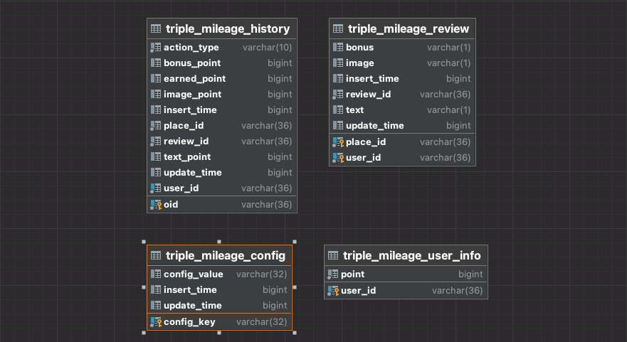

# Triple Backend 사전과제

---

Triple Backend 사전과제 제출물 입니다.

cqrs branch에 cqrs패턴을 사용한 버전도 구성하였습니다.

**사용 기술 스택**

- **Language : Java 11**
- **Build Tool : Gradle 7.4**
- **Framework : Spring Web MVC**
- **ORM : Spring Data JPA**
- **Database : Mysql 8.0.29**
- **Cache : Hazelcast**

# 실행 방법
1. Docker를 이용하여 mysql 기동
    - mileage-service/docker 디렉토리로 이동
    - 명령어 실행 : docker-compose up -d

2. 서버 기동 순서
    - IDE를 통해 기동 시 IDE로 mileage-web-svr 서버 기동
    - gradle을 통해 기동 시 gradlew bootjar 명령어 실행 후 gradlew bootRun

---

## API 목록
서버 URL : http://localhost:9201

- **리뷰 포인트 적립**
    - URI : /event
    - Method : POST
    - Content-Type : application/json
    - Parameter
        - type : 이벤트 타입 (REVIEW)
        - action : 이벤트 액션 타입 (ADD / MOD / DELETE)
        - reviewId : 사용자가 등록한 Review의 UUID
        - content : 사용자가 등록한 Review의 내용
        - attachedPhotoIds : 사용자가 등록한 Review에 포함된 사진
        - userId : Review를 등록한 사용자의 UUID
        - plcaeId : 사용자가 등록한 Review의 장소 UUID

- **사용자 포인트 조회**
    - URI : /get/{userId}
    - Method: GET
    - Parameter
        - userId : 조회할 사용자의 UUID

- **사용자 포인트 적립 내역 조회**
    - URI: /history/{userId}/{pagePerSize}/{page}
    - Method: GET
    - Parameter
        - userId : 조회할 사용자의 UUId
        - pagePerSize : 한번에 요청할 최대 row
        - page : 요청할 페이지

## API Response

- ResponseDTO
    - success : 요청 성공 여부
    - statusCode : 요청에 대한 응답 코드 (성공 시 200, 실패 시 500)
    - error : 에러 발생 시 에러 코드
    - errorMsg : 에러 발생 시 에러 메시지
    - result : 리턴할 데이터가 존재할 시 결과값

## API Test

- **Swagger**를 이용하여 API 테스트

  [http://localhost:9201/swagger-ui/index.html](http://localhost:9201/swagger-ui/index.html)

## ERD
DB Schema 위치 : mileage-service/schema/001.schema_ddl.sql

